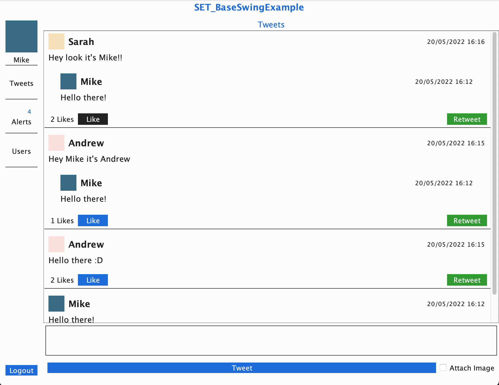
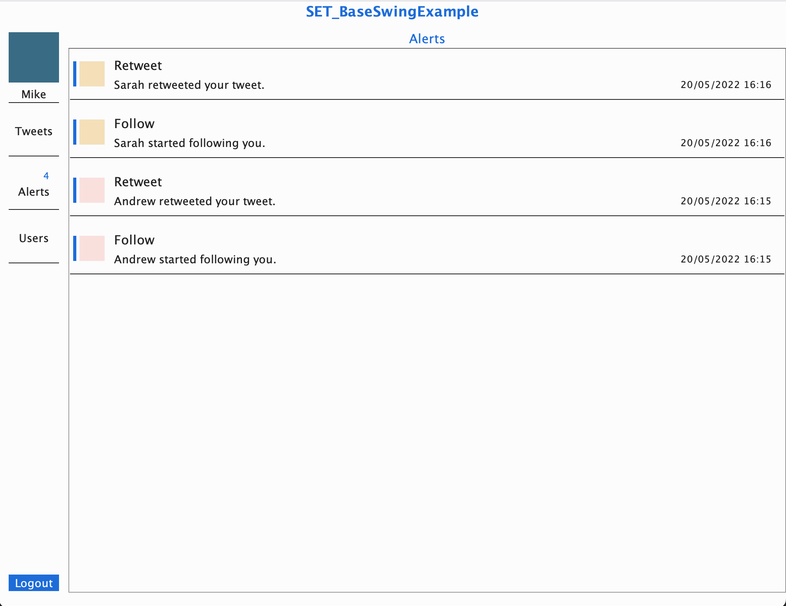
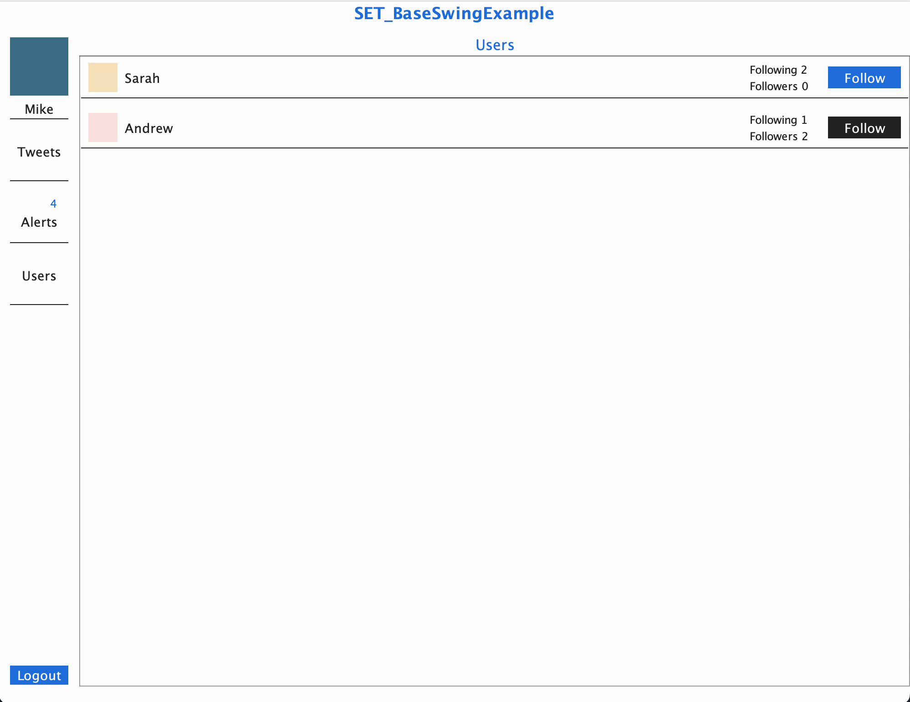

# Synthetic End-User Testing: Prototype
Replication package for paper `Synthetic End-User Testing: Modeling Realistic Agents Based on Behavioral Examples`

## Project Abstract
For software interacting directly with real-world end-users, it is common practice to script scenario tests validating the system’s compliance with a number of its features. However, these do not accommodate the replication of the type of end-user activity to which the system is required to respond in a live instance. It is especially true as compliance might also break in scenarios of interactions with external events or processes, such as other users. State-of-the-art approaches aim at inducing the software into run- time errors by generating tests that maximize some target metrics, such as code coverage. As a result, they suffer from targeting an infinitely large search space, are severely limited in recognizing error states that do not result in runtime errors, and the test cases they generate are often challenging to interpret. Other forms of testing, such as Record-Replay, instead fail to capture the end-users’ decision-making process, hence producing largely scripted test scenarios. Therefore, it is impossible to test a software’s compliance with unknown but otherwise plausible states. This paper introduces “Synthetic End-User Testing”, a novel testing strategy for complex systems in which real-world users are synthesized into reusable agents and employed to test and validate the software in a simulation environment. Hence, it discusses how end-user behavioral examples can be obtained and used to create agents that operate the target software in a reduced search space of likely action sequences. The notion of action expectation, which allows agents to assert the learned compliance of the system, is also introduced. Finally, a prototype asserting the feasibility of such a strategy is presented.

## Requirements
- Gradle: `7.4.1`
- Java: `16.0.2`

## No agent
This configuration allows for the execution of multiple frontends with
the recording of user actions.
User actions are always saved as `jsonl` Lifecycle files in `./LCs`.

### Backend
Only one backend must be launched.
A database instance must first be started.
This is set to run in a Docker container.
The following creates and starts the container.
```shell
sh ./src/main/java/backend/launch_db.sh
```

The backend instance can be run by running:
```shell
./gradlew backend
```
Please be mindful of the fact that the database instance is fully reset
upon starting the backend.


### Frontend
Any number of frontend instance can be launched as:
```shell
./gradlew frontend
```
Action tracking will be saved in a new file in `./LCs`.

## Single Client
After starting a database container instance with:
```shell
sh ./src/main/java/backend/launch_db.sh
```

A single frontend and backend instance may be most conveniently run with:
```shell
./gradlew run
```
Action tracking will be saved in a new file in `./LCs`.

## ReplayAgent
With a running instance of the backend, a ReplayAgent can be started with:
```shell
./gradlew randomAgent --args="<logfile>"
```
`<logfile>` is a Lifecycle file of the activity recorded about a real end-user.
Action tracking will be saved in a new file in `./LCs`.

## RandomAgent
With a running instance of the backend, a RandomAgent can be started with:
```shell
./gradlew randomAgent --args="handle passwd"
```
Where `handle` and `passwd` are the credential the agent will use
to signup and login into its account.
Action tracking will be saved in a new file in `./LCs`.

## Frequency Agent
With a running instance of the backend, a FrequencyAgent can be started with:
```shell
./gradlew frequencyAgent --args="handle passwd <logfile>"
```
Where `handle` and `passwd` are the credential the agent will use
to signup and login into its account.
`<logfile>` is a Lifecycle file of the activity recorded about a real end-user.
Action tracking will be saved in a new file in `./LCs`.

## Sample Images




